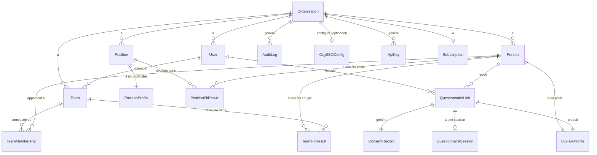

# Schéma de données — FitRadarHR

> Décisions de conception alignées sur : multi-tenant `org_id` (row-level), RGPD, EU AI Act, bilingue FR/EN.
> Statut : Draft v1 — 2026-06-30

---

## Diagramme entité-relation

---

## Entités

### `Organization`
Représente un tenant — organisation B2B ou espace personnel B2C.

| Champ | Type | Notes |
|---|---|---|
| `id` | UUID | Clé primaire |
| `name` | VARCHAR(255) | Nom de l'org ou "Espace de [prénom]" pour B2C |
| `account_type` | ENUM(`B2B`, `B2C`) | Détermine le parcours d'inscription |
| `questionnaire_version` | ENUM(`50`, `100`) | Version IPIP choisie par l'org (défaut : 50) |
| `language_default` | ENUM(`fr`, `en`) | Langue par défaut de l'org |
| `is_active` | BOOLEAN | Permet de désactiver un compte sans supprimer |
| `created_at` | TIMESTAMP | — |

---

### `User`
Utilisateur ayant un compte FitRadarHR (RH, Manager, ou Solo B2C).

| Champ | Type | Notes |
|---|---|---|
| `id` | UUID | — |
| `org_id` | UUID FK → Organization | Isolation tenant |
| `email` | VARCHAR(255) | Unique global |
| `first_name` | VARCHAR(100) | — |
| `last_name` | VARCHAR(100) | — |
| `role` | ENUM(`RH`, `MANAGER`, `SOLO`) | SOLO = B2C, cumule les droits RH+Manager |
| `language` | ENUM(`fr`, `en`) | Préférence individuelle |
| `is_active` | BOOLEAN | Désactivation sans suppression |
| `invited_by` | UUID FK → User (nullable) | Trace l'invitation |
| `created_at` | TIMESTAMP | — |
| `last_login_at` | TIMESTAMP | — |

> **Note :** le mot de passe est géré par django-allauth, pas stocké en clair. En V2, un utilisateur peut *en plus* se connecter via SSO (voir `OrgSSOConfig` ci-dessous) — le mot de passe n'est jamais supprimé ni remplacé, les deux modes de connexion coexistent.

---

### `OrgSSOConfig` *(V2)*
Configuration SSO OIDC d'une organisation — un IdP (ex. Keycloak) par organisation, jamais partagé entre tenants.

| Champ | Type | Notes |
|---|---|---|
| `id` | UUID | — |
| `org_id` | UUID FK → Organization (unique) | Un seul IdP par organisation (`OneToOne`) |
| `enabled` | BOOLEAN | Coupe le SSO sans perdre la config |
| `display_name` | VARCHAR(100) | Affiché sur le bouton "Se connecter avec…" |
| `login_slug` | VARCHAR(50), unique | Identifiant utilisé dans l'URL de connexion SSO |
| `issuer_url` | URL | Émetteur OIDC (endpoint de découverte) |
| `client_id` | VARCHAR(255) | — |
| `client_secret` | VARCHAR(255) | Write-only côté formulaire — jamais ré-affiché |
| `created_at` / `updated_at` | TIMESTAMP | — |

> Synchronisé en interne avec un `SocialApp` de `django-allauth` (`provider="openid_connect"`, `provider_id=login_slug`) — FitRadarHR s'appuie sur le flux OIDC déjà implémenté et audité par allauth plutôt que de ré-écrire l'échange de jetons.

---

### `ApiKey` *(V2 — API publique en lecture seule, US-E1-06)*
Clé d'accès à l'API publique, scopée à une seule organisation.

| Champ | Type | Notes |
|---|---|---|
| `id` | UUID | — |
| `org_id` | UUID FK → Organization | Isolation tenant stricte |
| `name` | VARCHAR(100) | Libellé libre, ex. "Intégration ATS Greenhouse" |
| `key_prefix` | VARCHAR(12), unique | Préfixe non secret (`frk_…`), affiché dans la liste pour identifier une clé |
| `key_hash` | VARCHAR(64) | Empreinte SHA-256 de la clé — la valeur en clair n'est **jamais stockée** |
| `created_by_id` | UUID FK → User (nullable) | — |
| `created_at` | TIMESTAMP | — |
| `last_used_at` | TIMESTAMP (nullable) | Mis à jour à chaque appel API authentifié |
| `revoked_at` | TIMESTAMP (nullable) | Révocation = horodatage, jamais de suppression physique (traçabilité, cohérent avec `AuditLog`) |

> La valeur en clair n'est visible qu'une seule fois, au moment de la génération (écran `/settings/api/`). Authentification API via l'en-tête `Authorization: Api-Key <clé>`. L'API expose en lecture seule : postes, équipes, personnes (+ statut questionnaire), résultats de fit — **jamais** les scores Big Five bruts d'un `BigFiveProfile`.

---

### `Subscription` *(V3 — plan gratuit et abonnement, US-E1-07)*
Statut de facturation d'une organisation — plan gratuit permanent (≤ 25 personnes) ou un seul plan payant. Le champ `trial_ends_at` et le statut `trialing` du modèle initial (essai 14 jours) ont été supprimés le 2026-07-06 (migration `billing.0002`).

| Champ | Type | Notes |
|---|---|---|
| `id` | UUID | — |
| `org_id` | UUID FK → Organization (unique) | Un seul abonnement par organisation (`OneToOne`) |
| `status` | ENUM(`free`, `active`, `past_due`, `canceled`) | Source de vérité côté FitRadarHR — mise à jour uniquement par le webhook Stripe (`free` par défaut à la création) |
| `stripe_customer_id` | VARCHAR(255), nullable | Créé au premier passage par Stripe Checkout |
| `stripe_subscription_id` | VARCHAR(255), nullable | Renseigné par le webhook `checkout.session.completed` |
| `current_period_end` | TIMESTAMP (nullable) | Synchronisé par le webhook `customer.subscription.updated` |
| `created_at` / `updated_at` | TIMESTAMP | — |

> Aucun prix stocké en base : le prix facturé est un objet Stripe (`Price`) référencé par `settings.STRIPE_PRICE_ID` — le prix affiché sur l'écran abonnement (39 €/mois) doit rester cohérent avec lui. `Subscription.has_full_access` fait autorité pour savoir si le quota du plan gratuit s'applique (abonnement `active` OU organisation de démonstration → accès complet). Voir `apps/billing/quotas.py` pour le seuil du plan gratuit (limite unique : 25 personnes au total dans l'organisation).

---

### `Position`
Poste créé par un RH ou un utilisateur Solo, avec un profil Big Five cible.

| Champ | Type | Notes |
|---|---|---|
| `id` | UUID | — |
| `org_id` | UUID FK → Organization | Isolation tenant |
| `title_fr` | VARCHAR(255) | Titre en français |
| `title_en` | VARCHAR(255) | Titre en anglais |
| `description_fr` | TEXT (nullable) | — |
| `description_en` | TEXT (nullable) | — |
| `department` | VARCHAR(100) (nullable) | — |
| `status` | ENUM(`active`, `archived`) | — |
| `created_by` | UUID FK → User | — |
| `created_at` | TIMESTAMP | — |
| `updated_at` | TIMESTAMP | — |

---

### `PositionProfile`
Profil Big Five cible associé à un poste (définition manuelle par le RH).
Relation 1-1 avec `Position`.

| Champ | Type | Notes |
|---|---|---|
| `id` | UUID | — |
| `position_id` | UUID FK → Position | — |
| `openness_min` | SMALLINT (0–100) | Fourchette cible par dimension |
| `openness_max` | SMALLINT (0–100) | — |
| `conscientiousness_min` | SMALLINT (0–100) | — |
| `conscientiousness_max` | SMALLINT (0–100) | — |
| `extraversion_min` | SMALLINT (0–100) | — |
| `extraversion_max` | SMALLINT (0–100) | — |
| `agreeableness_min` | SMALLINT (0–100) | — |
| `agreeableness_max` | SMALLINT (0–100) | — |
| `neuroticism_min` | SMALLINT (0–100) | — |
| `neuroticism_max` | SMALLINT (0–100) | — |
| `updated_at` | TIMESTAMP | — |

> **Design :** fourchette min/max plutôt qu'une valeur unique — permet d'exprimer "Agréabilité entre 60 et 80" sans sur-contraindre.

---

### `Team`
Équipe gérée par un Manager ou un utilisateur Solo.

| Champ | Type | Notes |
|---|---|---|
| `id` | UUID | — |
| `org_id` | UUID FK → Organization | Isolation tenant |
| `name` | VARCHAR(255) | — |
| `description` | TEXT (nullable) | — |
| `manager_id` | UUID FK → User | Manager responsable |
| `created_at` | TIMESTAMP | — |

---

### `TeamMembership`
Table de liaison Person ↔ Team. Conserve l'historique des appartenances.

| Champ | Type | Notes |
|---|---|---|
| `id` | UUID | — |
| `team_id` | UUID FK → Team | — |
| `person_id` | UUID FK → Person | — |
| `added_by` | UUID FK → User | Traçabilité |
| `joined_at` | TIMESTAMP | — |
| `left_at` | TIMESTAMP (nullable) | NULL = membre actuel |

---

### `Person`
Candidat externe ou collaborateur interne ayant reçu (ou pouvant recevoir) un questionnaire.
N'a pas nécessairement de compte `User`.

| Champ | Type | Notes |
|---|---|---|
| `id` | UUID | — |
| `org_id` | UUID FK → Organization | Isolation tenant |
| `email` | VARCHAR(255) | — |
| `first_name` | VARCHAR(100) | — |
| `last_name` | VARCHAR(100) | — |
| `person_type` | ENUM(`candidate`, `collaborator`) | — |
| `created_by` | UUID FK → User | Qui a créé la fiche |
| `created_at` | TIMESTAMP | — |

> **RGPD :** à la demande d'effacement, les champs `email`, `first_name`, `last_name` sont anonymisés (`[supprimé]`). L'enregistrement est conservé pour la traçabilité des rapports.

---

### `QuestionnaireLink`
Lien tokenisé envoyé à une `Person` pour accéder au questionnaire.

| Champ | Type | Notes |
|---|---|---|
| `id` | UUID | — |
| `org_id` | UUID FK → Organization | Isolation tenant |
| `person_id` | UUID FK → Person | — |
| `token` | VARCHAR(128) | Unique, signé via Django `TimestampSigner` |
| `questionnaire_version` | ENUM(`50`, `100`) | Hérite du paramètre org au moment de la création |
| `language` | ENUM(`fr`, `en`) | Langue choisie à l'envoi (modifiable par la personne) |
| `sent_by` | UUID FK → User | — |
| `sent_at` | TIMESTAMP | — |
| `expires_at` | TIMESTAMP | Défaut : +30 jours |
| `status` | ENUM(`pending`, `in_progress`, `completed`, `expired`) | — |
| `completed_at` | TIMESTAMP (nullable) | — |

---

### `ConsentRecord`
Consentement RGPD explicite recueilli avant la passation du questionnaire.

| Champ | Type | Notes |
|---|---|---|
| `id` | UUID | — |
| `link_id` | UUID FK → QuestionnaireLink | — |
| `consented_at` | TIMESTAMP | — |
| `consent_version` | VARCHAR(20) | Version du texte de consentement affiché (ex. `v1.0`) |
| `ip_address` | INET (nullable) | Preuve technique — à anonymiser après délai légal |
| `language` | ENUM(`fr`, `en`) | Langue dans laquelle le consentement a été lu |

> **RGPD :** enregistrement immuable (pas de UPDATE/DELETE par les utilisateurs).

---

### `QuestionnaireSession`
Sauvegarde de la progression en cours de passation (reprise possible).

| Champ | Type | Notes |
|---|---|---|
| `id` | UUID | — |
| `link_id` | UUID FK → QuestionnaireLink | — |
| `answers` | JSONB | `{"item_id": score, ...}` — réponses partielles |
| `current_item_index` | SMALLINT | Position dans le questionnaire |
| `started_at` | TIMESTAMP | — |
| `last_saved_at` | TIMESTAMP | Mise à jour à chaque sauvegarde auto |

> Supprimée après complétion du questionnaire (les réponses finales sont dans `BigFiveProfile`).

---

### `BigFiveProfile`
Résultat calculé du questionnaire Big Five d'une `Person`.

| Champ | Type | Notes |
|---|---|---|
| `id` | UUID | — |
| `person_id` | UUID FK → Person | — |
| `link_id` | UUID FK → QuestionnaireLink | Source du calcul |
| `openness` | DECIMAL(5,2) | Score 0–100 |
| `conscientiousness` | DECIMAL(5,2) | — |
| `extraversion` | DECIMAL(5,2) | — |
| `agreeableness` | DECIMAL(5,2) | — |
| `neuroticism` | DECIMAL(5,2) | — |
| `questionnaire_version` | ENUM(`50`, `100`) | Version utilisée |
| `algorithm_version` | VARCHAR(20) | Ex. `v1.0` — traçabilité EU AI Act |
| `computed_at` | TIMESTAMP | — |

---

### `PositionFitResult` / `TeamFitResult`
Résultats des calculs de fit (E5), recalculés automatiquement à chaque nouveau profil.
Un enregistrement par couple (personne, poste) ou (personne, équipe) — `unique_together`.

| Champ | Type | Notes |
|---|---|---|
| `id` | UUID | — |
| `person_id` | UUID FK → Person | Isolation tenant via `person__org` |
| `position_id` / `team_id` | UUID FK | Poste ou équipe évalué(e) |
| `person_profile_id` | UUID FK → BigFiveProfile (nullable) | Profil utilisé pour le calcul |
| `openness_fit` … `neuroticism_fit` | DECIMAL(5,2) | Score de proximité par dimension (0–100) |
| `overall_fit` | DECIMAL(5,2) | Moyenne des 5 dimensions — informatif, jamais décisionnel |
| `complementarity` | JSONB | `TeamFitResult` uniquement — signal par dimension (`similar` / `different` / `complementary`) |
| `team_size_at_computation` | SMALLINT | `TeamFitResult` uniquement |
| `algorithm_version` | VARCHAR(20) | Traçabilité EU AI Act |
| `computed_at` | TIMESTAMP | — |

> **Principe :** les scores alimentent la restitution visuelle et textuelle ("points à approfondir"), jamais une décision binaire — human in the loop.

> **Historique :** un modèle `FitReport` prévu au cadrage initial a été remplacé par ces deux tables (supprimé en juillet 2026, migration `reports/0002`).

---

### `AuditLog`
Journal immuable de toutes les actions sensibles (EU AI Act + RGPD).

| Champ | Type | Notes |
|---|---|---|
| `id` | UUID | — |
| `org_id` | UUID FK → Organization | — |
| `user_id` | UUID FK → User (nullable) | NULL si action système |
| `action` | VARCHAR(100) | Ex. `report.viewed`, `link.sent`, `pdf.exported`, `person.deleted` |
| `entity_type` | VARCHAR(50) | Ex. `PositionFitResult`, `Person`, `QuestionnaireLink` |
| `entity_id` | UUID | — |
| `metadata` | JSONB (nullable) | Contexte additionnel (ex. version algo) |
| `created_at` | TIMESTAMP | — |

> Aucun UPDATE ou DELETE autorisé sur cette table, même pour un ADMIN.

---

## Règles transverses

1. **Isolation tenant** : chaque requête filtre systématiquement par `org_id` via un Django model manager (`OrgQuerySet`). Aucune vue ne peut afficher des données cross-tenant.
2. **Pas de score de décision unique** : les résultats de fit stockent 5 scores dimensionnels ; le score global est informatif, jamais un agrégat décisionnel binaire.
3. **Traçabilité** : toute consultation de rapport, export PDF et envoi de lien est inscrit dans `AuditLog`.
4. **RGPD / droit à l'effacement** : anonymisation des champs PII de `Person` (nom, email) sur demande — les résultats de fit et `AuditLog` associés sont conservés sans lien nominatif.
5. **UUID partout** : pas d'auto-increment entier exposé en URL (évite l'énumération).

---

*Dernière mise à jour : 2026-07-02*
